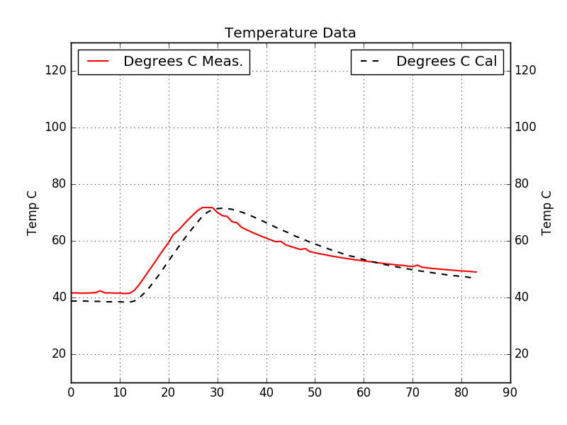

# 6301-lab3
Temperature sensor evaluation board for Arduino Nano. Custom PTAT cell and dual-slope ADC design. The PTAT cell features breakaway design of the temperature sense area for remote measurement. Final error after calibration was less than 5%.

Circuit and layout drawn in Altium 17.0.

[BOM for this project as Digikey Cart Share](http://www.digikey.com/short/35444m)

-------

### Revision 1 Errata
Updated Dec 13, 2016

#### Critical/Major
1. R8 should pull up to VCC3V3 for stability, not VCC5V which is not well regulated and prone to noise.
2. U1 pins 2, 4, and 6 (base) should be shorted together. The current design only connects pins 4 and 6, which results in half the expected PTAT current.
3. A 100 ohm resistor should be put across J20 for stability of VREF.

#### Minor
4. Pad size for C5 is too small for most 1uF film capacitors. Suggest to change to 1210 footprint.
5. Jumpers have 0402 footprint, which have pads that do not short well with manual solder rework. Suggest to change to 0805 or 1206 footprint. Alternatively populate with 0402 0 ohm resistors.
6. Add a 4k7 ohm pull up resistor to VCC5V on Arduino pin 12 for one-wire parasitic power.

-------

### 3D Render

-------

### Conversion Results

Linearity is very good. There is a constant offset error, which can be removed through calibration.

-------

### Python Plotter Script

The included Python script `plotter.py` allows for a realtime graph of temperature values. It also logs all values to a txt file.

