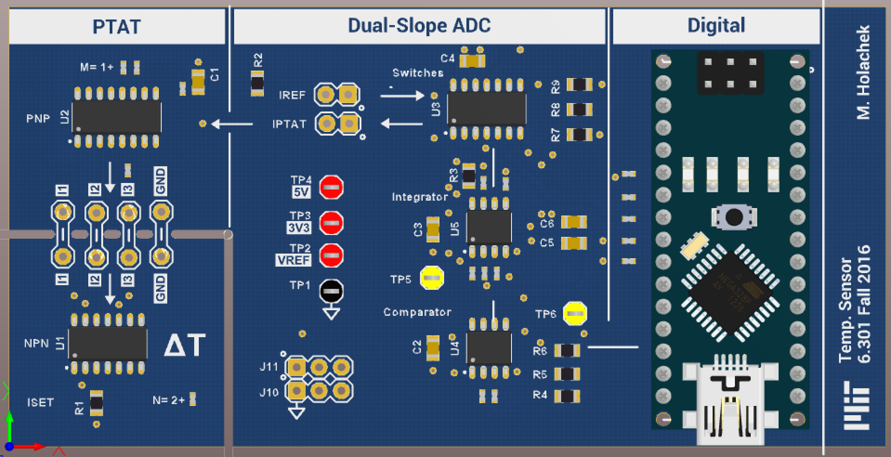

# 6301-lab3
Temperature sensor carrier board with PTAT cell, dual-slope ADC, and Arduino Nano.
The PTAT cell features breakaway design of the temperature sense area, for remote sensing.
Circuit and layout drawn in Altium 17.0.

[BOM for this project as Digikey Cart Share](http://www.digikey.com/short/35444m)

-------

### Revision 1 Errata
Updated Dec 8, 2016

#### Critical/Major
1. R8 should pull up to VCC3V3 for stability, not VCC5V which is not well regulated and prone to noise.
2. U1 pins 2, 4, and 6 (base) should be shorted together. The current design only connects pins 4 and 6, which results in half the expected PTAT current.

#### Minor
3. Pad size for C5 is too small for most 1uF film capacitors. Suggest to change to 1210 footprint.
4. Jumpers have 0402 footprint, which have pads that do not short well with manual solder rework. Suggest to change to 0805 or 1206 footprint. Alternatively populate with 0402 0 ohm resistors.

-------

### 3D Render

